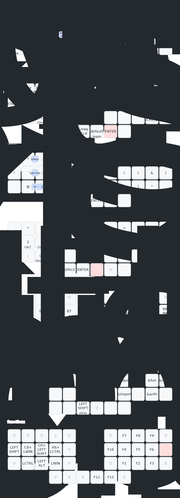

G# zmk-config-skeletyl

fork from [This skeletyl zmk repo](https://github.com/cyanindya/zmk-config), dev branch, and update the setting for pins(amoeba)

## keymap

drawn with this [workflow](https://github.com/caksoylar/keymap-drawer)

